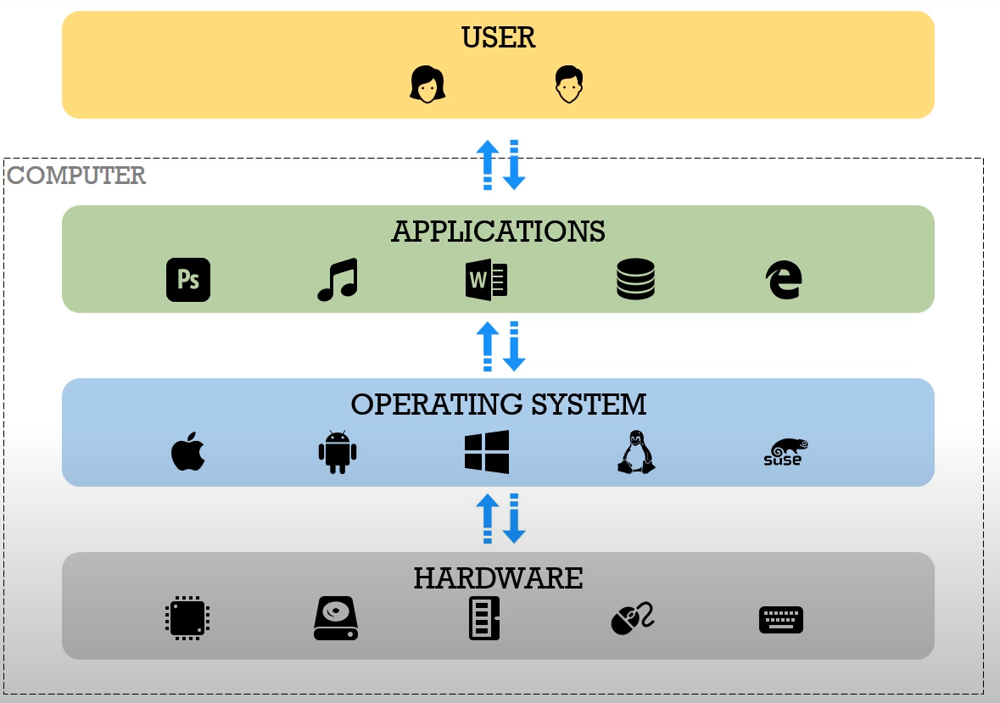

# OS and general knowledge

0.1. [Linux directory structure](https://linuxhandbook.com/linux-directory-structure/)
0.2. [Absolute & relative path](https://linuxhandbook.com/absolute-vs-relative-path/)
1. [Terminal usage](https://www.youtube.com/watch?v=jDINUSK7rXE)
   1. [Linux Command Line](https://www.youtube.com/watch?v=YHFzr-akOas&list=PLS1QulWo1RIb9WVQGJ_vh-RQusbZgO_As)
2. [Basic Terminal Command (Linux)](https://www.fosslinux.com/45587/linux-command-cheat-sheet.htm)
   1. [Awesome bash](https://github.com/awesome-lists/awesome-bash)
   2. [Explain Shell - write down a command-line to see the help text that matches each argument](https://explainshell.com/)
3. [How OSs work in general](https://infinite.education/view/how_oss_work_in_general)
   1. [Computer science crash course](https://www.youtube.com/watch?v=tpIctyqH29Q&list=PL8dPuuaLjXtNlUrzyH5r6jN9ulIgZBpdo)
   2. **TL;DR**: Operating System is a software installed on a computer(i.e. PC, laptop, smartphones) in which it gives an interface to make it easier for users to a run other software applications and tweak hardware settings.
    
4. **[Operation System Notes](https://applied-programming.github.io/Operating-Systems-Notes/)**
   1. Process Management
   2. Threads and Concurrency
   3. Memory Management
   4. Inter Process Communication
   5. I/O Management
   6. ...
5. [POSIX](https://en.wikipedia.org/wiki/POSIX)
   1. [stdin, stdout, stderr](http://www.learnlinux.org.za/courses/build/shell-scripting/ch01s04.html)
   2. [Linux Basics: How to use Linux Standard Input and Output](https://www.youtube.com/watch?v=YYz8Y_UBrvw)
   3. [Pipe() tutorial for linux](https://www.youtube.com/watch?v=uHH7nHkgZ4w)
